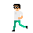

<h1 align="center">
  
  Game Developer  
  
</h1>

Hi there! I'm Kaue Godoy, a passionate game developer with experience in creating 2D, 3D and VR games. Welcome to my GitHub profile!

---

<h2 align="left">Skills</h2>

  

<h3 align="left">Game Development</h3>

  <strong>Main</strong> 
  
  
  
   
  <strong>Basic Experience</strong> 
  
  
  

<h3 align="left">Web Development</h3>

  
  
  

<h3 align="left">Languages</h3>

  <strong>:brazil: Portuguese</strong> (Native) 
  <strong>:us: English</strong> (Fluent, TOEIC C1) 
  <strong>:jp: Japanese</strong> (Advanced, JLPT N2)

---

<h2 align="left">Games</h2>

<h3 align="left">Ike</h3>

Global Game Jam 2023

<h3 align="left">Camundangos</h3>

Metroidvania [Final Paper]

---

<h2 align="left">Contact</h2>

  :email: <a href="mailto:kauegodoy@live.com">kauegodoy@live.com</a> 
  :envelope: <a href="https://www.linkedin.com/in/kaue-godoy/">LinkedIn</a>

