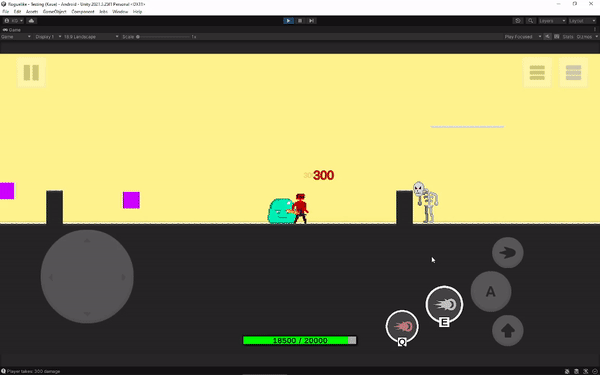

<h1 align="center">
  
  Kaue Godoy
  

</h1>

<h1 align="center">Aspiring Game Developer</h1>
  
:game_die: Currently learning **Unity**

:video_game: Working on [a roguelike game](https://github.com/KaueGodoy/ROGUELIKE)

<h1 align="left">Skills</h1>

<h3 align="left">Game Development</h3>

  

Main

  
  
  
   
  
  
Basic Experience

  
  
    
  

<h3 align="left">Web Development</h3>

  
  
  

<h3 align="left">Languages</h3>

:brazil: Native language
  
:us: Fluent level
  
:jp: Advanced level (JLPT N2)
  

<h1 align="left">Games</h1>

<h3 align="left">Ike</h3>

 global game jam 2023 
  
 remake version in development

  
  

<h3 align="left">Derildo's Adventure</h3>

  roguelike
  
  final paper [work in progress]

  
  

<h1 align="left">Website</h1>

<h3 align="left">Derildo's Adventure website</h3>

  HTML, CSS, JS, PHP

  
  
  

  
<h1 align="left">Contact</h1>

:e-mail:kauegodoy@live.com

:envelope:[Linkedin](https://www.linkedin.com/in/kaue-godoy/)
